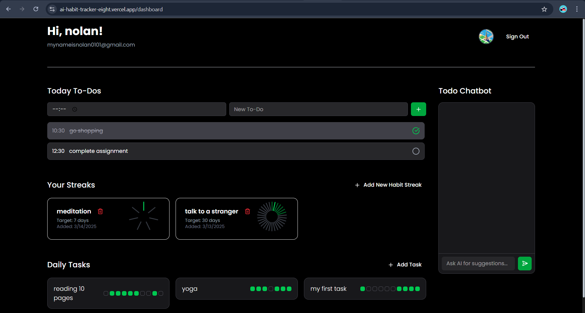
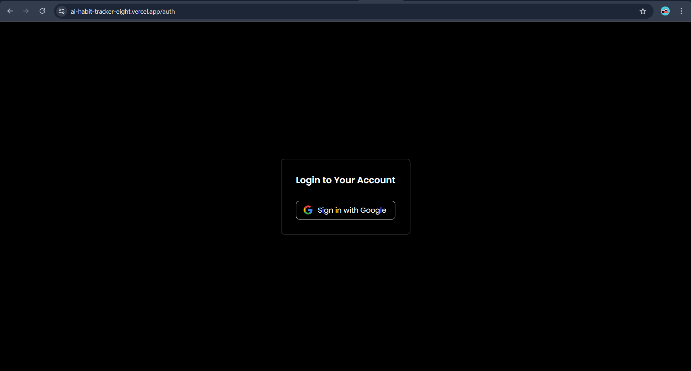
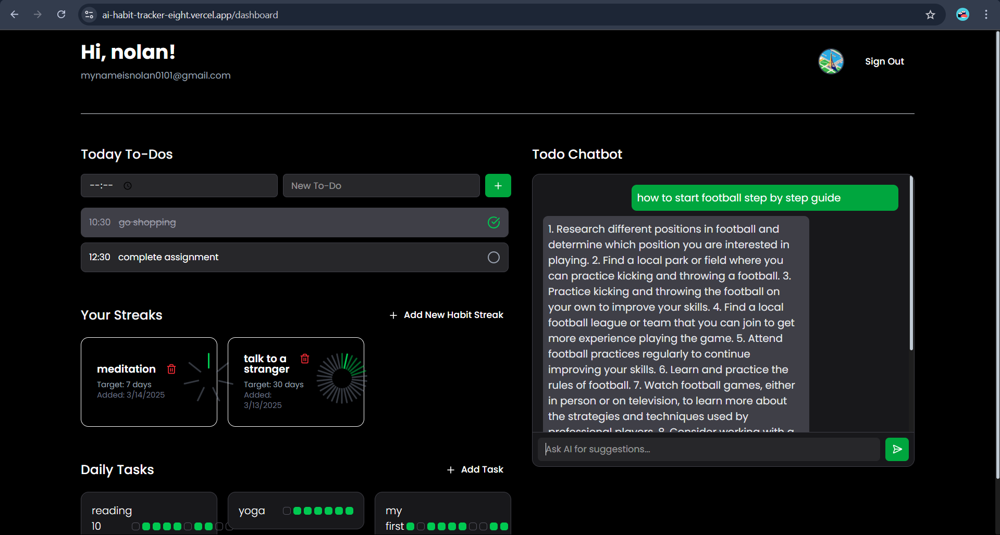
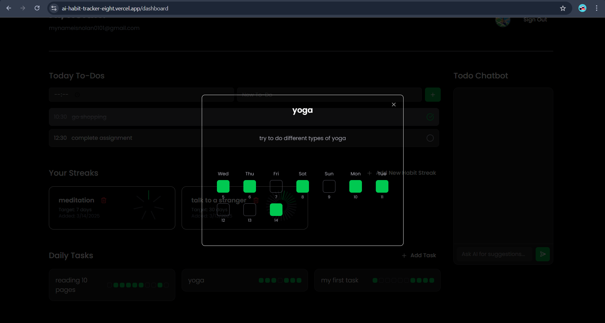

# 🚀 AI Habit Tracker

An AI-powered Habit Tracker web app to help you stay productive and consistent with your daily goals. Manage habits, set tasks, and get smart AI suggestions to improve your routine — all in a beautiful, intuitive interface.

---
## 🌐 Live Demo

🔗 **Check out the live app on Vercel**: [ai-habit-tracker](https://ai-habit-tracker-eight.vercel.app/dashboard)

---
## 📸 Screenshots

### ✅ Dashboard View


### ✅ Auth View


### ✅ AI Suggestions


### ✅ Task Detail View


---

## 💡 Features

- ✅ **Add, Edit, Delete Habits**
- ✅ **Organize and Prioritize Tasks**
- ✅ **AI-Powered Habit Suggestions (using Groq API)**
- ✅ **Firebase Authentication (Google Login)**
- ✅ **Progress Visualization (Habit Wheel & Charts)**
- ✅ **Drag and Drop Todo List**
- ✅ **Responsive Design for Mobile and Desktop**
- ✅ **Dark Mode & Modern UI (Shadcn + Tailwind CSS)**

---

## ⚙️ Tech Stack

- **Next.js 15 (App Router)**
- **TypeScript**
- **Tailwind CSS + ShadCN UI**
- **Firebase (Auth, Firestore)**
- **Groq API for AI Suggestions**
- **Vercel for Deployment**

---

## 🔑 Environment Variables

To run this project, you will need to add the following environment variables in a `.env.local` file:

```env
NEXT_PUBLIC_FIREBASE_API_KEY=YOUR_FIREBASE_API_KEY
NEXT_PUBLIC_FIREBASE_AUTH_DOMAIN=YOUR_FIREBASE_AUTH_DOMAIN
NEXT_PUBLIC_FIREBASE_PROJECT_ID=YOUR_FIREBASE_PROJECT_ID
NEXT_PUBLIC_FIREBASE_STORAGE_BUCKET=YOUR_FIREBASE_STORAGE_BUCKET
NEXT_PUBLIC_FIREBASE_MESSAGING_SENDER_ID=YOUR_MESSAGING_SENDER_ID
NEXT_PUBLIC_FIREBASE_APP_ID=YOUR_FIREBASE_APP_ID
NEXT_PUBLIC_GROQ_API_KEY=YOUR_GROQ_API_KEY
NEXT_PUBLIC_GROQ_API_URL=https://api.groq.com/openai/v1/chat/completions
```


🚀 Getting Started
1. Clone the Repository
```
git clone https://github.com/esc-nolan/ai-habit-tracker
cd ai-habit-tracker
```
2. Install Dependencies
```
npm install
```
3. Add Environment Variables
Create a .env.local file and add your Firebase and Groq API keys as mentioned above.

4. Run the Development Server
```
npm run dev
```
Open http://localhost:3000 in your browser to see the app.

✅ Deployment
To deploy this project on Vercel:

```
Ensure all environment variables are added in Vercel's dashboard under Project Settings > Environment Variables.
```
📂 Folder Structure
```
ai-habit-tracker/
├── src/
│   ├── app/
│   ├── components/
│   ├── elements/
│   ├── lib/
├── public/
├── screenshots/  # Place screenshots here for README
├── .env.local
├── package.json
└── README.md
```


🙌 Acknowledgments
```
Next.js
Firebase
Groq
Tailwind CSS
Shadcn UI
```